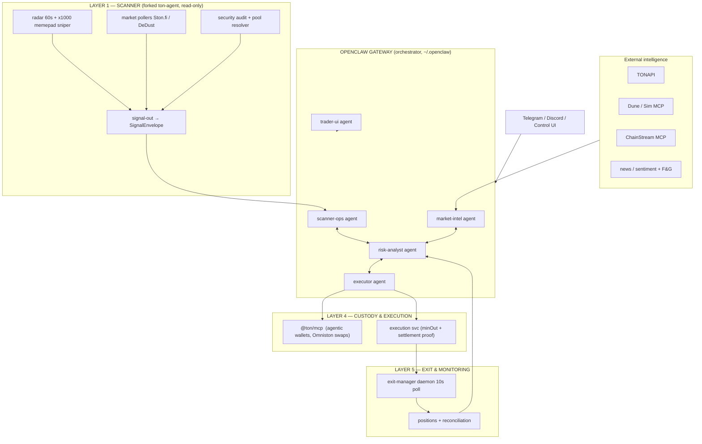
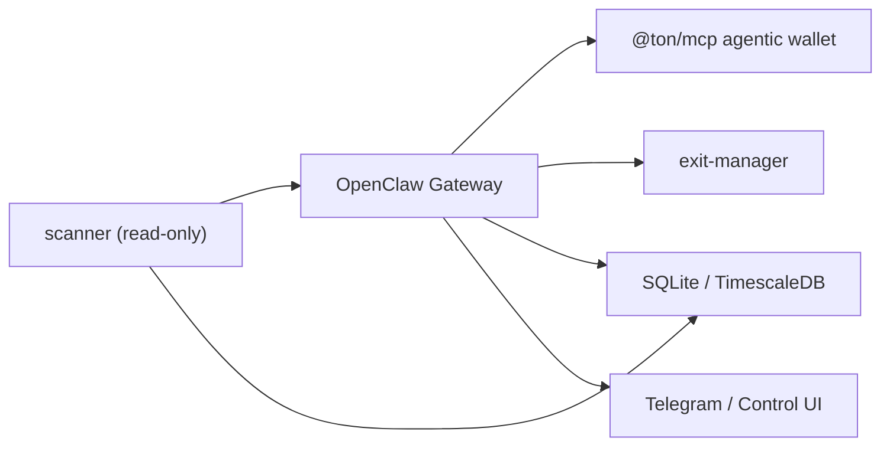

# openclaw-ton-agent — High-Level Architecture

> A professional autonomous AI multi-agent TON trading system.
> **OpenClaw orchestrates the brain; the existing `ton-agent` engine becomes a read-only scanning layer; `@ton/mcp` agentic wallets own custody and execution.**

Status: DESIGN v1 — high level. Decisions are flagged `[DECIDE]` where operator input is required.

---

## 1. Why a new project

`ton-agent` is a monolithic self-executing bot (detects → plans → trades → exits in one
process). This design **reuses its proven detection/audit/DEX layers** but:

- **Delegates the brain** to OpenClaw: multi-agent personas, skills (ClawHub `SKILL.md`),
  MCP plugins, channels (Telegram/Discord), cron, webhooks.
- **Separates detection from execution** so the scanner never touches funds.
- **Fills the layers deepwiki research confirmed are missing today** in `ton-agent`:
  explicit TP/SL point setup, trailing/break-even/ROI-table exits, market-regime & sentiment
  intel, backtesting/hyperopt, custody via agentic wallets, and operator reporting.

Keeping it as a new repo (`openclaw-ton-agent`) avoids mutating the still-running `ton-agent`.

---

## 2. Principles

1. **Scanner does not trade.** `ton-agent` core runs in a read-only, observe-only profile and
   emits normalized `SignalEnvelope`s. All money movement happens only through the executor.
2. **Deterministic gates outrank the LLM.** Kill switch, circuit breaker, SafetyCaps, per-tier
   risk configs stay local and hard-coded-gated. LLM agents propose; deterministic gates dispose.
3. **Split-key custody.** No raw mnemonic in the trading process. `@ton/mcp` **agentic wallets**
   (owner key held by operator, operator key held by agent) with on-chain rotation.
4. **Everything is a signal first.** One `SignalEnvelope` schema flows scanner → intel → risk →
   executor → monitor. Each stage can only annotate or reject, never fabricate.
5. **No native TON on-chain stop orders** (verified: wallet-contract has no SL/TP primitive).
   All exits are **off-chain poll-based** (10s cadence) with on-chain balance proof — mirroring
   `tradr`'s exit-manager and `ton-agent`'s position-monitor.
6. **Config-driven risk.** Every threshold exposed via `CONFIG`/env (the hardcode-removal work
   already done in `ton-agent` carries over).

---

## 3. System context



---

## 4. Layers

| Layer | Owner | Reused from ton-agent | New (gaps deepwiki found) |
|---|---|---|---|
| **L1 Scanner** | `scanner/` process | radar, x1000 client+filters, market pool-sources, audit.ts, pool-resolver, TONAPI | signal-out bus, read-only MCP resources, SignalEnvelope |
| **L2 Intelligence** | OpenClaw `market-intel` | — | regime classifier, indicators (EMA/RSI/MACD/ATR/VWAP/CVD), sentiment/news/emergency-halt, whale watch via Dune/Sim/ChainStream |
| **L3 Decision & Risk** | OpenClaw `risk-analyst` + local gates | guardrails (TIER_RISK_CONFIGS), scoring, SafetyCaps, kill-switch, circuit breaker | R:R pre-filter, Kelly sizing, cooldown, correlation reduction, max-drawdown |
| **L4 Custody & Execution** | `executor` + `@ton/mcp` | dex/router (Ston.fi/DeDust), minout, swap-gas-guard, settlement proof | agentic wallets, Omniston path, human-in-the-loop confirm |
| **L5 Exit & Monitoring** | `exit-manager` | exit-policy-engine, trend-monitor, rug-detector, volatility-regime, atr-band | explicit TP/SL points, trailing, break-even, ROI table, time-stop, staged TP |
| **L6 Ops/UI** | OpenClaw `trader-ui` | webhook envelopes, /healthz | Telegram commands, dashboard, watchdog, weekly report |

---

## 5. Multi-agent personas (OpenClaw `agents.entries`)

| agentId | Role | Key skills | Tool policy |
|---|---|---|---|
| `scanner-ops` | Ingests scanner signals, health | `ton-signal-ingest`, `ton-audit`, TON docs | read-only; no exec |
| `market-intel` | Regime, sentiment, whales | `crypto-market-sentiment`, `whale-watching-guide`, Dune/Sim/ChainStream | read-only; web |
| `risk-analyst` | Gates + sizing verdicts | `ton-risk-gates`, `ton-tpsl-manager`, sperax `defi-risk-assessment` | read + DB |
| `executor` | Approves + sends txns | `@ton/mcp` (agentic), `ton-execute` | write; per-tx confirm; elevated-from `trader-ui` |
| `trader-ui` | Telegram/Dashboard, manual override | `manual-override`, `ton-reporting` | can force-exit via kill switch |

Bindings route channels (e.g. Telegram DM → `trader-ui`, alerts group → `market-intel`).
Set `tools.agentToAgent.enabled` with allowlist `[scanner-ops, market-intel, risk-analyst, executor]`
so signals flow agent-to-agent. Skills live per-agent with a shared baseline
(`agents.defaults.skills`); the executor agent is the only one with write/exec tools.

---

## 6. Skills strategy

**Consume (ClawHub / local):**
- TON official bundle (`ton-org/skills`): `ton-create-wallet`, `ton-balance`, `ton-swap`, `ton-send`, `ton-docs`, `ton-manage-wallets`, `ton-xstocks`.
- TON MCP portal servers: TON Blockchain MCP (`@ton/mcp`), TON Documentation MCP (`https://docs.ton.org/mcp`).
- Sperax knowledge skills (informational, read-only): `token-discovery-guide`, `crypto-market-sentiment`, `whale-watching-guide`, `defi-risk-assessment`, `crypto-portfolio-management`, `token-swap-best-practices`, `crypto-price-data-guide`.
- Dune + Sim MCP (already in `~/.openclaw/skills`) for on-chain analytics; ChainStream MCP for token/wallet/DEX-alert tooling.

**Ship (our own `skills/` in this repo, ClawHub `SKILL.md` format):**
| slug | purpose |
|---|---|
| `ton-signal-ingest` | Teaches agents the `SignalEnvelope` schema + how to consume scanner output |
| `ton-tpsl-manager` | TP/SL point setup: derive stop/target from ATR + volatility regime + tier config |
| `ton-exit-modes` | Exit-mode table (snipe/swing/gamble/diamond) + trailing/break-even/ROI-table rules |
| `ton-risk-gates` | Deterministic gate order, Kelly sizing, cooldown, drawdown rules |
| `ton-execute` | Execution checklist: minOut, gas guard, settlement proof, confirm flow |
| `ton-reporting` | Weekly report, drift monitor, reconciliation runbook |

---

## 7. Data contract — SignalEnvelope

```ts
interface SignalEnvelope {
  id: string;                 // stableId (webhook.idempotency-compatible)
  ts: number;
  source: "radar" | "x1000" | "audit" | "pool" | "manual";
  token: {
    address: string;          // jetton master
    name: string; ticker: string; decimals: number;
    priceTon: number; curvePct: number; liquidityTon: number;
    holders?: number; tags?: string[];
  };
  audit?: { verified: number; renounced: boolean; locked: boolean; honeypot: boolean };
  score?: { soft: number; risk: number };   // 0..100
  meta?: Record<string, unknown>;
}
```
Consumed by `market-intel` (regime/sentiment enrichment → `annotated`), `risk-analyst`
(sizing/gate verdict → `gated`), `executor` (execution → `position`). Every stage appends,
never mutates prior fields. JSONL journal mirrors `decision_journal` in ton-agent.

---

## 8. Exit & TP/SL design (the flagged missing layer)

TON has **no native on-chain stop orders** (wallet-contract is a plain payment wallet).
Therefore exits are **off-chain, poll-based (10s)** + **on-chain balance verification**.

### 8.1 Exit modes (ported from `tradr`, extended with openclaw-trader protections)

| mode | stop | take-profit | trailing | notes |
|---|---|---|---|---|
| `snipe` | 0.85x | 1.3x sell 30% | 10% from peak | quick in/out, low conviction |
| `swing` | 0.70x | 1.3x sell 30% | tiered 15/25% | standard (ton-agent default) |
| `gamble` | 0.50x | none | 30% from peak | high risk |
| `diamond` | none | none | none | manual only |

### 8.2 Point setup (`ton-tpsl-manager` skill)
- **Stop** = max(tier hard floor, entry × (1 − ATR×k)) using `volatility-regime` + `atr-band`
  corroboration (journal-only, never a trigger).
- **Target** = entry × (1 + target multiple) with **time-stop** (max_hold_ms already in ton-agent
  positions table) and **ROI table** (time-decayed targets from openclaw-trader).
- **Break-even** move after profit threshold; **staged TP** (partial sells tracked via
  `remaining_usd`-style fields).
- **Exit confirmation**: reject abnormal exits on flash crashes (`confirmedByFeeds`,
  `rug-detector`, trend-monitor flip) before executing.

### 8.3 Exit manager daemon
`exit-manager/` polls open positions (10s), applies the position's mode, executes sells via the
executor with minOut + settlement proof, verifies on-chain balance delta, updates position JSONL
+ SQLite. Mirrors `tradr`'s `exit-manager.py` + ton-agent `position-monitor`.

---

## 9. Risk layers

1. **Entry gates**: R:R pre-filter, entry slippage guard, cooldown per token, correlation-based
   position reduction, mcap ceiling, already-in-position check (port from openclaw-trader + tradr).
2. **Sizing**: tier-scaled Kelly (`risk-analyst` proposes, deterministic cap wins) — reuse ton-agent
   `TIER_RISK_CONFIGS` + `sizing.ts`.
3. **Drawdown**: max-drawdown guard + kill switch (ton-agent coordinator already polls a kill-switch
   store) + circuit breaker.
4. **Reconciliation**: boot-time on-chain balance reconciliation (ton-agent
   `reconcilePositionsAtBoot`) — fails closed, never fabricates.
5. **Guardrail ceilings**: per-tier max position TON / max open positions / TP / SL / slippage
   ceilings already env-routed in ton-agent `guardrails.ts` — reused verbatim.

---

## 10. Custody & Execution

- **Primary**: `@ton/mcp` **agentic wallets** (registry `~/.config/ton/config.json`). Owner key
  stays with operator; operator key lives with the agent; on-chain rotation via
  `agentic_rotate_operator_key`. Swaps via `@ton/mcp` → Omniston aggregator.
- **Alternative / fallback**: ton-agent `dex/router.ts` direct Ston.fi/DeDust routing with
  `minout`, `swap-gas-guard`, and the 99%-threshold settlement proof — behind an executor that is
  the only tool caller allowed `execute_swap`.
- Every transfer is **confirm-first** (the executor agent must surface a confirm prompt to
  `trader-ui`/operator for `auto` mode; `paper` and `notify_only` modes never move funds).

---

## 11. Backtesting & evaluation (new)

Replay recorded `SignalEnvelope`s against historical pool price series (TimescaleDB
`market_data`/`trades` already persisted by ton-agent):
- Realistic costs via `spread_bps` + gas model (swap-gas-guard).
- Intra-candle high/low exit checks (ton-agent price-source already stores 3s ticks).
- Metrics: Sharpe, Sortino, Calmar, max DD, win rate, profit factor.
- Optional Bayesian hyperopt + walk-forward over strategy params (reference openclaw-trader).
- **Drift monitor**: compare paper vs live fills to detect slippage divergence.

---

## 12. Profitability & Edge (hard requirement)

> **Nobody can guarantee a memepad sniper is profitable — least of all at a fixed
> date.** The current `ton-agent` has never measured its own expectancy (no backtest,
> no win-rate ledger). This section defines what *can* be guaranteed: a system that
> quantifies its edge, is only allowed to trade with a measured positive edge, and
> **kills itself** when the edge disappears. Shipping on the finish date is a
> milestone; shipping *profitable* is not promised — **profitable** is **gated**.

### 12.1 The structural math (why snipers usually lose)

| factor | where it lives today | effect |
|---|---|---|
| 0.1 TON network fee each direction | `x1000-client.ts:375` | a 0.05 TON lot needs **+400%** just to break even (`engine.ts:300`) |
| curve fee + affiliate routing | `AFFILIATE` `x1000-client.ts:31` | pad + MEV bots capture priority; late snipers are exit liquidity |
| base scan hit-rate | filters/softScore | typical memepad base rate is **<10% winners**; expectancy is decided by payoff, not hit-rate |
| 99% settlement tolerance | settlement.ts | slippage/rounding can eat the edge on thin pads |
| no stop primitive on TON | wallet-contract | exits must be poll-based; a 10s delay on a rug = total loss |

### 12.2 Edge-first gates (go/no-go, not soft goals)

Every gate is **deterministic and blocks live execution** until passed:

1. **G1 — Backtest threshold.** Replay ≥ 30 days of recorded envelopes; require
   **positive expectancy**, profit factor > 1.3, and Sharpe > 0.5 after fees, slippage
   (`spread_bps`) and gas. Fails → remain `notify_only`/`paper`.
2. **G2 — Paper demo.** ≥ 2 weeks of `paper` mode with the *same* code path (fills +
   settlement proof, not simulated prices). Require positive net PnL and **drift
   monitor** (paper vs expected slippage) within tolerance.
3. **G3 — Live demo on smallest tier.** `auto` unlocks only on `low` tier with a
   hard cap; require +10 trades, positive expectancy, and **no single-trade loss >
   X%** before `mid`/`high` unlock.
4. **G4 — Continuous kill.** If rolling 7-day expectancy goes negative, the
   kill switch flips to halt; auto-stop, operator reviews. Edge is earned and
   re-measured — it is never assumed.

> **Requirement (operator-accepted 2026-08-14):** G1–G4 are hard gates, not goals.
> Project "done" = P0–P5 built **and** G1–G2 pass; live money only after G3.
> Trading may be paused indefinitely if measured expectancy is not positive.

### 12.3 Levers that actually move the edge (build these first)

- **Entry price quality** over scan count: verify fill vs `network_fee` at order
  time (`ton-execute`), reject pads where 2× fees > expected move.
- **MEV/priority discipline**: only enter when the lot survives fee + 1 ATR of
  slippage (`minout` computed from live reserves, not API quote).
- **Anti-rug filters as gate, not garnish**: renounce/lock/honeypot + curve sanity +
  min liquidity are **hard** pre-entry gates (already in `filters.ts`/`audit.ts`).
- **Asymmetric exits**: win ≥ 3× the 0.1 TON fee round-trip or don't take the trade
  (R:R pre-filter in `ton-risk-gates`).
- **Fees & sizing coupled**: `positionSizeTon ≥ fee×2 / targetMultiple` so a winner
  actually covers costs (Kelly × tier ceiling).
- **Settlement as first-class proof**: the 99%-delta proof books the PnL correctly;
  without it, expectancy is unknowable.
- **Per-mode win/loss ledger** keyed by exit mode → drives `score_to_mode` auto
  selection instead of guesswork.

---

## 13. Deployment topology


- Single host (Fly.io or VPS), Node 26. `scanner`, `exit-manager`, `OpenClaw Gateway` as
  supervised services; `@ton/mcp` as an HTTP MCP server registered in `openclaw.json`.
- `OBSERVE_ONLY=true` for `scanner`; a `paper` executor for dry-run; `auto` only behind
  confirm flow + kill switch.

---

## 14. Phased roadmap

> Gate legend: **P** = builds the capability, **G1–G4** = edge gates that block the next
> phase. "Finish" (project complete) means **P0–P5 done and G1–G2 passed** — not
> "guaranteed profitable." Live money only after G3.

| Phase | Scope | Exit criterion | Blocked by | Status (2026-08-14) |
|---|---|---|---|---|
| **P0** | Repo scaffold: docs, workspaces, `openclaw.json`, skills skeleton | gateway boots with 5 agents, no tools | — | DONE |
| **P1** | Fork scanner (read-only) + `signal-out` + `ton-signal-ingest` | envelopes flowing scanner → agent, journaled | — | DONE |
| **P2** | `market-intel` (regime + sentiment + whales) + `ton-risk-gates` | gated candidate feed, R:R + Kelly verdicts | — | DONE |
| **P3** | `@ton/mcp` agentic wallet wiring + `executor` + `ton-execute` | paper-mode fills with settlement proof | **G1** (backtest +EV) | DONE (notify_only/paper; `auto` refuses pre-ack) |
| **P4** | `exit-manager` + `ton-tpsl-manager` + `ton-exit-modes` | automated TP/SL/trailing/break-even on positions | — | DONE |
| **P5** | Backtest + hyperopt + per-mode win/loss ledger + reporting | eval report + dashboard live | — | DONE (replay harness, real-data input, hyperopt, ledger, static eval report; trader-ui consumes report) — real ≥30d CEX cross-rate bar pipeline live (`--fetch-bars`: TON base = CoinGecko since Binance TONUSDT is BREAK; quote = Binance klines); first real-data G1 reading FAIL (expected) |
| **P6** | `paper` → `auto` on `low` tier only, kill-switch UX, hardening | **G2** passed; supervised low-tier auto trading | **G2** (paper demo +EV) | — |
| **P7** | Scale to `mid`/`high` tiers, drift monitor, continuous kill (G4) | positive 7-day rolling expectancy | **G3** (live demo +EV) | — |

---

## 15. Open decisions `[DECIDE]`

1. **Scanner data plane `[DECIDED 2026-08-14]`**: **Hybrid.** Keep Ston.fi/DeDust REST pollers as
   the scanning data plane (battle-tested in ton-agent for price discovery); add **Omniston** (via
   `@ton/mcp`) as the primary execution/quote path with direct-router fallback.
2. **Custody `[DECIDED 2026-08-14]`**: **`@ton/mcp` agentic wallets for all execution.** Split
   owner/operator keys, on-chain rotation. Direct router never holds keys — the executor agent is
   the only key-touching caller.
3. **DB `[DECIDED 2026-08-14]`**: **Hybrid (as ton-agent already runs).** SQLite (`agent.db`) for
   operational state (positions, journal, tiers); TimescaleDB for `market_data`/`trades` price
   series. Reuse both; no migration.
4. **Backtest scope `[DECIDED 2026-08-14]`**: **Minimal replay first** — replay recorded
   `SignalEnvelope`s against TimescaleDB price series with `spread_bps` + gas. Hyperopt/walk-forward
   is an optional P7+ add-on, not a P0–P5 dependency.
5. **Operator confirm `[DECIDED 2026-08-14]`**: progression `notify_only → paper → auto`. Checkpoint
   for `auto` = **local deterministic gates must pass** (SafetyCaps, risk-gate, R:R, sizing cap),
   then the executor surfaces a **confirm prompt** to `trader-ui` for (a) the first 10 live trades
   and (b) any trade above `SIZE_CONFIRM_THRESHOLD_TON`; smaller trades auto-execute below the
   threshold. Kill switch + circuit breaker remain operator-invokable at all times.
6. **Licensing `[DECIDED 2026-08-14]`**: **MIT confirmed.** `openclaw-trader` (GPLv3) is referenced
   for patterns only; no code is copied.
7. **Edge bar `[DECIDED 2026-08-14]`**: **ACCEPTED** — the G1–G4 gates are the definition of
   "profitable". Live trading may be paused indefinitely until measured expectancy is positive.
   This is a project requirement, not a suggestion.
